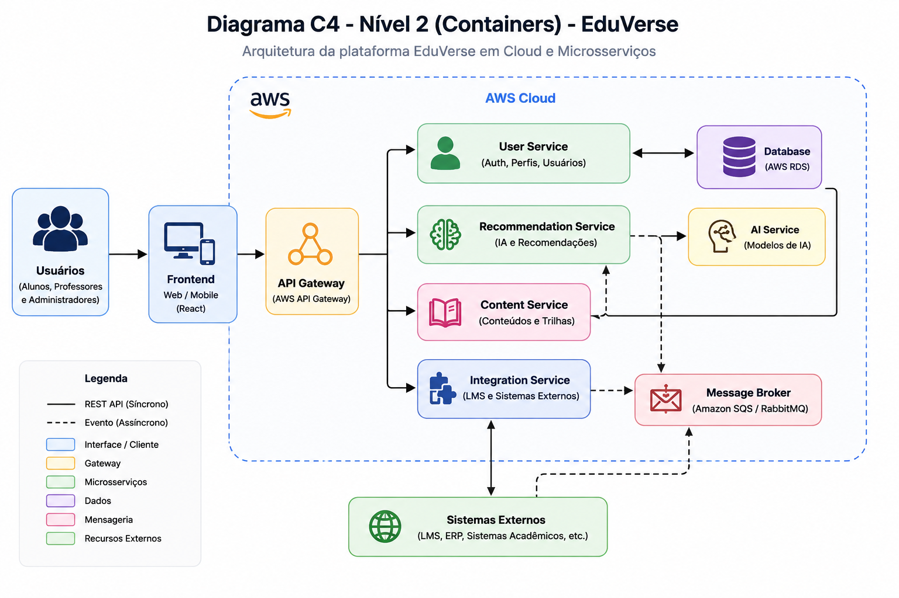
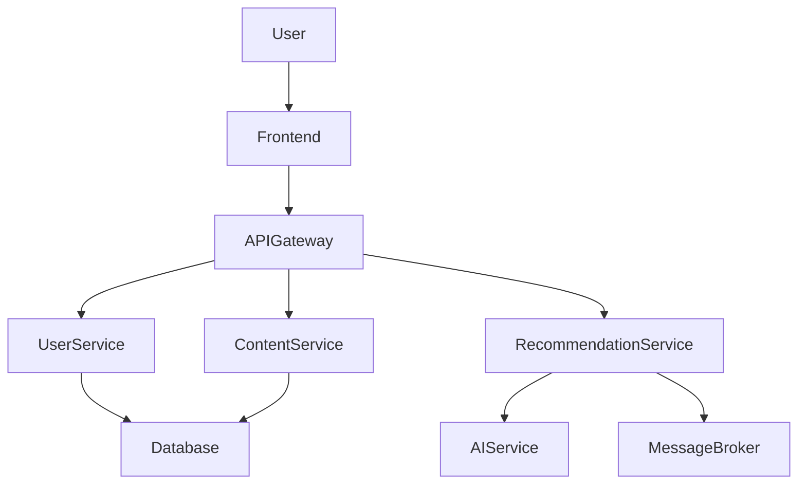

#  EduVerse - Plataforma de Aprendizado Inteligente

## Visão Executiva

O EduVerse é uma plataforma de aprendizado adaptativo que utiliza Inteligência Artificial para personalizar trilhas de ensino com base no desempenho dos alunos. O sistema resolve o problema da baixa eficiência no aprendizado tradicional, oferecendo recomendações inteligentes e feedback em tempo real.

Na Fase 3, a arquitetura foi evoluída para um modelo baseado em **Cloud e Microsserviços**, garantindo escalabilidade, resiliência e alta disponibilidade.

---

## Arquitetura (C4 - Containers)

### Visual (Imagem)



---

## Estratégia de Cloud

A solução utiliza AWS com abordagem baseada em containers (PaaS), permitindo escalabilidade horizontal automática e alta disponibilidade.

---

## ADRs (Decisões Arquiteturais)

* [ADR 0001 - Estratégia de Nuvem](docs/adrs/0001-estrategia-nuvem.md)
* [ADR 0002 - Resiliência](docs/adrs/0002-padrao-resiliencia.md)
* [ADR 0003 - Comunicação](docs/adrs/0003-modelo-comunicacao.md)

---

## SAD (Software Architecture Document)

* [SAD Fase 3](docs/sad/sad-fase3.md)

---

## Como executar o projeto

```bash
git clone https://github.com/WagdoJR/EduVerseAtt
cd eduverse
docker-compose up
```

---

## Tecnologias utilizadas

* Node.js / Java (backend)
* React (frontend)
* Docker
* AWS (ECS, RDS)
* RabbitMQ (mensageria)

---

## Evolução Arquitetural

O sistema evoluiu de uma arquitetura monolítica/hexagonal para microsserviços distribuídos em cloud, permitindo maior escalabilidade e resiliência.

---
